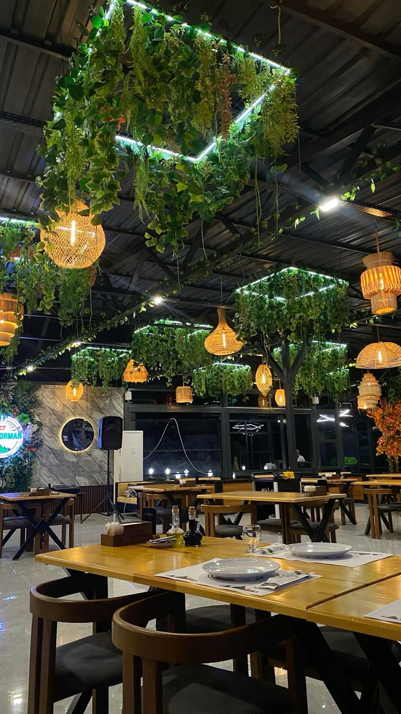

# 🍽️ NOIRÉ — Restaurant Gastronomique

Site web premium pour restaurant gastronomique avec commande en ligne et réservation de tables.



---

## ✨ Fonctionnalités

- 🎨 **Design premium** noir / or / crème
- 📱 **Responsive** (mobile, tablette, desktop)
- 🛒 **Panier** avec persistance (localStorage)
- 🍽️ **Filtres** de menu (entrées, plats, desserts, boissons)
- 📅 **Réservation** de table avec validation
- 💬 **Notifications toast** élégantes
- 🎬 **Animations** au scroll (reveal)
- ♿ **Accessible** (ARIA, prefers-reduced-motion)
- ⚡ **Performant** (RAF throttle, IntersectionObserver)
- 🔍 **SEO optimisé** (meta tags, JSON-LD)
- 📱 **PWA** (installable sur mobile)

---

## 🛠️ Technologies

- **HTML5** sémantique
- **CSS3** moderne (variables, grid, animations)
- **JavaScript** vanilla (ES6+, modules)
- **Google Fonts** (Cormorant Garamond + Montserrat)
- **Pillow** (Python) pour la génération des favicons

---

## 📁 Structure

---

## 🚀 Installation locale

1. Clone ou télécharge le projet
2. Ouvre `index.html` avec **Live Server** (VS Code)

### Générer les favicons

```bash
pip install pillow
python generate-favicon.py

---

# 📱 ÉTAPE 2 — PWA (Progressive Web App)

## 2.1 — Créer `site.webmanifest`

Crée **`site.webmanifest`** à la racine :

```json
{
    "name": "NOIRÉ — Restaurant Gastronomique",
    "short_name": "NOIRÉ",
    "description": "Commandez vos plats ou réservez votre table chez NOIRÉ.",
    "start_url": "/",
    "scope": "/",
    "display": "standalone",
    "orientation": "portrait-primary",
    "background_color": "#08080a",
    "theme_color": "#08080a",
    "lang": "fr",
    "dir": "ltr",
    "icons": [
        {
            "src": "android-chrome-192x192.png",
            "sizes": "192x192",
            "type": "image/png",
            "purpose": "any"
        },
        {
            "src": "android-chrome-512x512.png",
            "sizes": "512x512",
            "type": "image/png",
            "purpose": "any"
        },
        {
            "src": "apple-touch-icon.png",
            "sizes": "180x180",
            "type": "image/png",
            "purpose": "maskable"
        }
    ],
    "shortcuts": [
        {
            "name": "Commander",
            "url": "/#menu",
            "description": "Voir la carte et commander"
        },
        {
            "name": "Réserver",
            "url": "/#reservation",
            "description": "Réserver une table"
        }
    ]
}